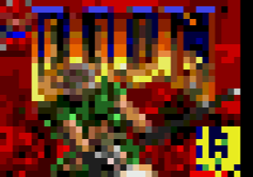
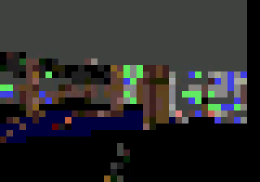
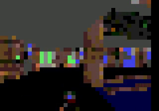

# Genesis64KBDoom

<table>
  <tr>
    <td></td>
    <td></td>
    <td></td>
  </tr>
  <tr>
    <td align="center">タイトル画面</td>
    <td align="center">ゲーム画面 1</td>
    <td align="center">ゲーム画面 2</td>
  </tr>
</table>

[FrenkelS/Doom64KB](https://github.com/FrenkelS/Doom64KB) を **Sega Genesis / Mega Drive** へ移植したもの。
SGDK + marsdev(m68k-elf) で Linux ネイティブビルドする。

このリポジトリは [FrenkelS/Doom64KB](https://github.com/FrenkelS/Doom64KB) からの fork。

Doom64KB は「RAM 64KB・ROM 大容量」向けの Doom 移植で、Genesis(68000, メイン RAM 64KB) は
ターゲットとして好相性。Neo Geo 版(`i_neogeo.c` / `i_neogev.c`)も同じ 68000・big-endian の
ため、プラットフォーム非依存の Doom コードは無修正で動作し、置き換えるのは I/O 層 2 ファイルだけ。

## デモ動画

https://www.youtube.com/watch?v=op3LCBNLuqo

DOOM running on the Sega Mega Drive / Genesis, ported from Doom64KB.

Music: the in-game MIDI is from
https://www.vgmusic.com/file/f4135d253bec49497cb3323be35a0cce.html
converted to VGM (Mega Drive YM2612 FM) with akiyan/midi2vgm:
https://github.com/akiyan/midi2vgm

## ROM Image Downloads

- Releases: https://github.com/akiyan/genesis-DOOM64KB/releases

## 関連記事

- https://www.akiyan.com/blog/archives/2026/06/sega-genesis-doom-port.html

## 状態

- ✅ ブート / WAD 読み込み（886KB の WAD を ROM に埋め込み）
- ✅ 3D BSP レンダリング（壁・床・天井・スプライト）
- ✅ デモ自動再生（DEMO3 / E1M1）
- ✅ 256 色 → Genesis 64 色（4 パレット x 16）量子化パレット、ダメージ/取得フラッシュ
- ✅ ジョイパッド入力
- ✅ HUD / メニュー / 自動マップのテキスト（SGDK 内蔵フォントをセルへ配置。白/赤/黄/灰の 4 色）
- ✅ サウンド（BGM / XGM PCM 効果音）
- ⏳ 画面ワイプ、ファジー（不可視）エフェクト

対応マップは Doom 1 E1M1 と E1M8 のみ（Doom64KB の仕様）。

## 描画方式

VDP プレーン A を **38x28 のチャンキー・フレームバッファ**として使う。各セル = 8x8 の
ベタ塗りタイル 1 個。Doom の 1 ピクセル列描画はそのまま 1 セルへ書き込み、`I_FinishUpdate`
でタイルマップを一括 DMA する。Doom の 256 色は `scripts/genpal.py` がメディアンカットで
量子化する。

パレット配分（4 パレット x 16 色）: 各パレットの **index 0 = 黒**、**index 15 = テキスト色**
（PAL0 白 / PAL1 赤 / PAL2 黄 / PAL3 灰）を予約し、残り index 1..14 を 3D ビュー用にする
（ビュー = 4 x 14 = **56 色**）。テキストは SGDK 内蔵フォント（前景 = index 15）のグリフタイルを
セルへ書き込み、パレット選択で色を変える。

## ビルド

必要環境（Ubuntu 24.04 系）:

- `m68k-elf-gcc`(marsdev) を `$HOME/toolchains/mars/m68k-elf/bin` に（`MARSDEV` で上書き可）
- `default-jre-headless`（rescomp 用）
- `vendor/sgdk` に SGDK v2.11 をネイティブビルドしたもの（`bin/` のホストツールと `lib/libmd.a`）
- BGM 用 VGM: `res/e1m1.vgm`
- 無音 VGM: `res/silent.vgm`
- SFX 抽出用 WAD: `scripts/doom1.wad`

VGM ファイルはリポジトリには含めない。各自で上記パスへ配置してからビルドする。
`res/music.res` の `XGM` リソースとして SGDK rescomp に渡され、ビルド時に XGM へ変換される。
`doom1.wad` もリポジトリには含めない。ビルド時に DS* lump を抜き出して `src/gen_sfx.h` を生成する。
別の場所にあるファイルを使う場合は、ビルド時にパスを指定できる。

```sh
./build.sh                 # out/rom.bin を生成
BGM_VGM=~/music/e1m1.vgm SILENT_VGM=~/music/silent.vgm DOOM1_WAD=~/wads/doom1.wad ./build.sh
BGM_VGM=res/silent.vgm ./build.sh   # BGM 無音版
SFX_SILENT=1 ./build.sh             # SFX 無音版
TITLE_DEMO_SECONDS=10 ./build.sh
TIMEDEMO=1 ./build.sh      # 起動直後に DEMO3 を再生するベンチ版（3D描画確認用）
```

`build.sh` が行う前処理:

1. `scripts/doom64.wad`（同梱）を 68000 向けに 4 バイト整列で再パックし `src/doom64ng.h` を再生成
   （非整列 lump を WAD へ直接 far 参照すると 68000 で address error になるため）
2. `scripts/genpal.py` で PLAYPAL → Genesis 64 色パレット/LUT(`src/gen_pal.h`)を生成
3. `scripts/gen_sfx.py` で `doom1.wad` の DS* lump → XGM PCM 用 SFX データ(`src/gen_sfx.h`)を生成
   （`SFX_SILENT=1` の場合は無音 SFX データを生成）
4. SGDK rescomp で `res/music.res` の VGM → XGM データを生成

## 動作確認（ヘッドレス）

```sh
xvfb-run -a retroarch -L /usr/lib/x86_64-linux-gnu/libretro/genesis_plus_gx_libretro.so \
  out/rom.bin --record out.mkv --size 320x224 --max-frames 600
```

## 移植のポイント（I/O 層以外で必要だった調整）

- `compiler.h`: SGDK ビルド時に `types.h`/`memory.h`/`string.h` を先読みし、`false/true` と
  `malloc/free` マクロを undef。`<stddef.h>/<stdint.h>` を types.h より前に読み u32 二重定義を回避。
- `src/ctype.h` / `src/stdlib.h` / `src/stdio.h`: SGDK・newlib のヘッダ衝突を避ける最小シム。
- `src/i_stubs.c`: `-nostdlib` で不足する `printf`/`exit`/`memcmp`/`memchr`/`labs`/`strcasecmp`/`abs`。
- `w_wad.c` / `r_data.c`: SGDK の `strncpy` が NUL パディングしないため名前比較用バッファをゼロ初期化。
- WAD の 4 バイト整列（`scripts/repack_wad.py`）。

## メモリ

メインRAM 64KB。静的(SGDK + Doom globals + 画面)約 14KB、Doom zone ヒープ 43KB
（`HEAP_SIZE` で調整。これ以上はスタックと衝突）。
